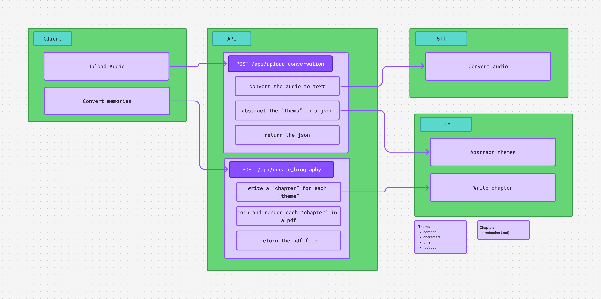

# Epimeteo AI 

📖 **Preservando historias, vidas y memorias.**  
Epimeteo convierte una conversación grabada en una biografía estructurada.

---

## 🧩 Propósito

Muchas historias familiares desaparecen sin ser contadas.  
Epimeteo nace para capturarlas fácilmente, sin necesidad de entrevistas formales ni procesos complejos.

Solo grabas una conversación.  
La aplicación se encarga del resto.

---

## 🎙️ ¿Qué hace?

Dado un archivo de audio (podcast, grabación móvil, conversación informal), el sistema:

1. **Transcribe la conversación**  
   Reconoce el audio y separa automáticamente los distintos hablantes.

2. **Identifica al entrevistado**  
   Y clasifica sus respuestas como bloques de contenido relevantes.

3. **Agrupa la información en *temas***  
   Cada tema contiene:
   - **Titulo**
   - **Personajes involucrados**
   - **Contexto temporal** (si existe)
   - **Contenido**

4. **Genera una línea de vida**  
   Ordenando cronológicamente los eventos clave.

5. **Transforma los temas en narrativa**  
   Con la ayuda de un modelo de lenguaje local, se redactan:
   - capítulos
   - resúmenes

6. **Exporta el resultado** *(WIP)*  
   - 📘 PDF tipo libro  

---

## Diagrama 

---

## 🧠 Tecnologías

- **Server app**
  - Next.js (React + TypeScript)

- **Speech-to-Text**
  - Whisper (OpenAI)
  - Wrapper Node: https://github.com/ariym/whisper-node  

- **LLM local**
  - Llama 
  - Wrapper Node: https://github.com/withcatai/node-llama-cpp

---

## 🤝 Contribuciones

Ideas, preguntas y feedback son bienvenidos mientras el proyecto evoluciona.

---
Prueba Alec
